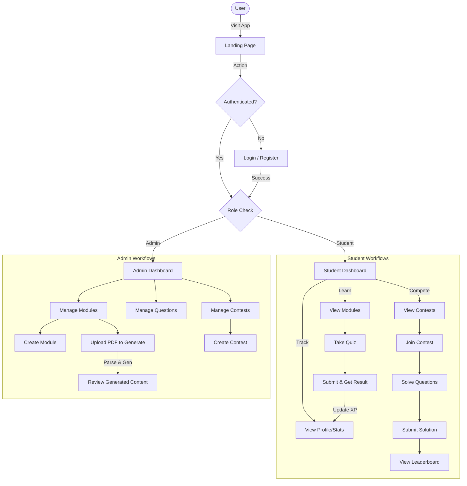
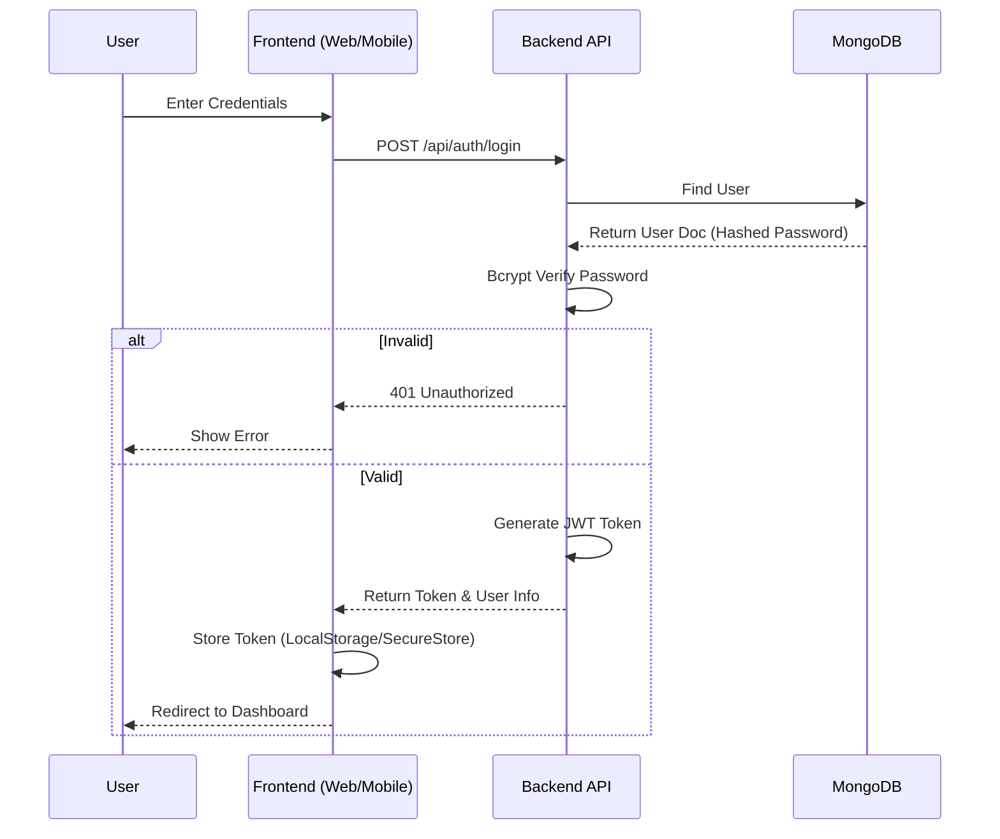
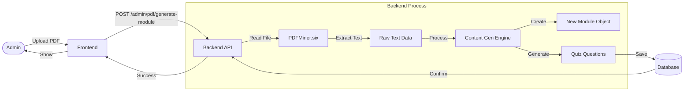
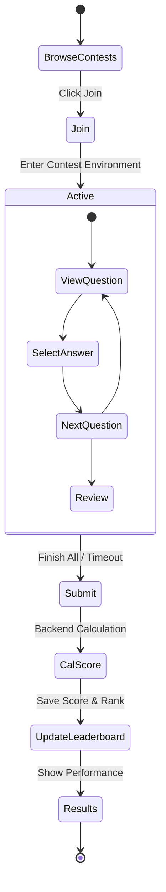

# Complete Application Workflow Diagram

## 1. High-Level User Journey

## 2. Detailed Authentication & Authorization Flow

## 3. PDF-to-Module Generation Workflow (Admin)

## 4. Contest Participation Workflow

